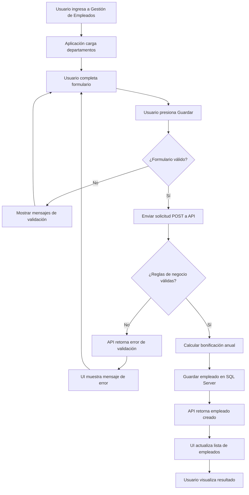
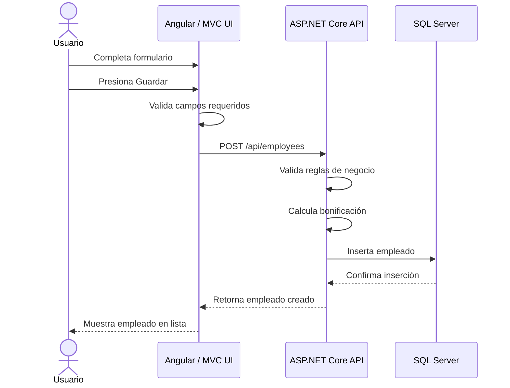

# R0 - Diagrama del proceso

## 1. Objetivo del diagrama

Representar el flujo principal del sistema para registrar empleados, validar datos, calcular bonificación anual y consultar empleados registrados.

Este documento cubre el rubro:

> Presenta diagrama completo del problema. Paso a paso del proceso.

---

## 2. Actores involucrados

| Actor | Descripción |
|---|---|
| Usuario | Persona que registra y consulta empleados desde la aplicación web |
| Sistema Web | Interfaz utilizada para capturar y mostrar información |
| API | Servicio REST responsable de procesar solicitudes |
| Base de datos | Repositorio donde se almacenan empleados y departamentos |

---

## 3. Flujo principal: registrar empleado

1. El usuario ingresa a la pantalla de gestión de empleados.
2. El sistema carga la lista de departamentos disponibles.
3. El usuario completa el formulario de empleado.
4. El usuario presiona el botón Guardar.
5. El sistema valida los datos ingresados.
6. Si los datos son inválidos, el sistema muestra mensajes de validación.
7. Si los datos son válidos, la aplicación envía la solicitud a la API.
8. La API valida nuevamente las reglas de negocio.
9. La API calcula la bonificación anual.
10. La API guarda el empleado en la base de datos.
11. La API retorna el empleado creado.
12. La interfaz actualiza la lista de empleados.
13. El usuario visualiza el empleado registrado.

---

## 4. Flujo alterno: datos inválidos

1. El usuario intenta guardar un empleado con datos incompletos o inválidos.
2. El sistema detecta errores de validación.
3. El sistema muestra mensajes específicos por campo.
4. El sistema no envía la información a la API si el error puede detectarse en frontend.
5. Si el error se detecta en backend, la API retorna una respuesta de error.
6. La interfaz muestra el mensaje de error recibido.

---

## 5. Flujo alterno: error técnico

1. El usuario intenta consultar o registrar empleados.
2. La aplicación envía la solicitud a la API.
3. La API no responde o retorna error.
4. La interfaz muestra un mensaje controlado.
5. El sistema evita mostrar errores técnicos internos al usuario final.

---

## 6. Diagrama de flujo general

---

## 7. Diagrama de secuencia

---

## 8. Validaciones del proceso

| Paso | Validación |
|---|---|
| Captura de datos | Campos requeridos |
| Captura de correo | Formato válido |
| Selección de departamento | Departamento obligatorio |
| Captura de salario | Mayor a cero |
| Captura de fecha de ingreso | No futura |
| Backend | Revalidación de reglas de negocio |
| Persistencia | Confirmación de inserción en base de datos |

---

## 9. Resultado esperado

Al finalizar el flujo exitoso:

1. El empleado queda registrado.
2. El empleado aparece en la lista.
3. La bonificación anual se muestra calculada.
4. Los datos quedan listos para persistencia en SQL Server.
5. La aplicación muestra mensajes claros en caso de error.