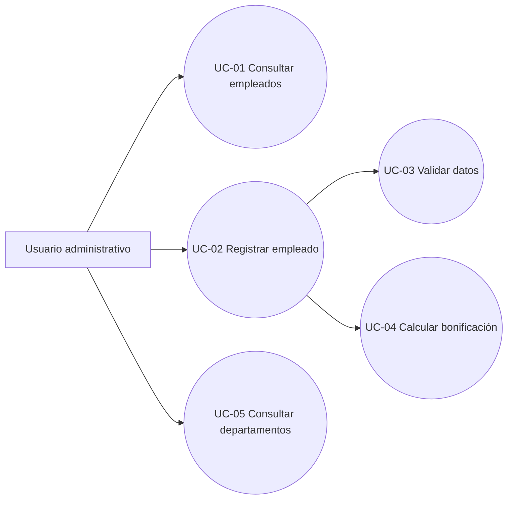

# R0 - Casos de uso

## 1. Objetivo

Documentar los casos de uso principales del sistema de gestión de empleados.

Este documento cubre el rubro:

> Genera los casos de usos del problema.

---

## 2. Actores

| Actor | Descripción |
|---|---|
| Usuario administrativo | Persona encargada de registrar y consultar empleados |
| Sistema | Aplicación web y API encargadas de validar, calcular y persistir información |

---

## 3. Lista de casos de uso

| Código | Caso de uso | Actor principal |
|---|---|---|
| UC-01 | Consultar empleados | Usuario administrativo |
| UC-02 | Registrar empleado | Usuario administrativo |
| UC-03 | Validar datos de empleado | Sistema |
| UC-04 | Calcular bonificación anual | Sistema |
| UC-05 | Consultar departamentos | Usuario administrativo |

---

# UC-01 - Consultar empleados

## Descripción

Permite al usuario visualizar la lista de empleados registrados en el sistema.

## Actor principal

Usuario administrativo.

## Precondiciones

1. El usuario tiene acceso a la aplicación.
2. El sistema se encuentra disponible.

## Flujo principal

1. El usuario ingresa a la pantalla de gestión de empleados.
2. La interfaz solicita la lista de empleados a la API.
3. La API consulta los empleados registrados.
4. La API retorna la lista de empleados.
5. La interfaz muestra la lista al usuario.

## Flujo alterno

### FA-01: No existen empleados registrados

1. La API retorna una lista vacía.
2. La interfaz muestra el mensaje: "No hay empleados registrados."

### FA-02: Error consultando empleados

1. La API no responde o retorna error.
2. La interfaz muestra el mensaje: "No fue posible cargar los empleados."

## Postcondiciones

El usuario visualiza la lista de empleados o un mensaje controlado.

---

# UC-02 - Registrar empleado

## Descripción

Permite al usuario registrar un nuevo empleado en el sistema.

## Actor principal

Usuario administrativo.

## Precondiciones

1. El usuario tiene acceso a la aplicación.
2. Existen departamentos disponibles.
3. El formulario de registro está disponible.

## Datos de entrada

| Campo | Requerido | Validación |
|---|---:|---|
| Nombre completo | Sí | Mínimo 3 caracteres |
| Correo electrónico | Sí | Formato válido |
| Departamento | Sí | Debe existir |
| Salario mensual | Sí | Mayor a cero |
| Fecha de ingreso | Sí | No futura |

## Flujo principal

1. El usuario ingresa a la pantalla de gestión de empleados.
2. El sistema muestra el formulario de registro.
3. El usuario completa los datos requeridos.
4. El usuario presiona Guardar.
5. El sistema valida los datos ingresados.
6. El sistema envía la solicitud a la API.
7. La API valida reglas de negocio.
8. La API calcula la bonificación anual.
9. La API guarda el empleado.
10. La API retorna el empleado creado.
11. La interfaz actualiza la lista de empleados.
12. El sistema muestra el empleado registrado.

## Flujo alterno

### FA-01: Datos inválidos

1. El usuario intenta guardar datos incompletos o inválidos.
2. El sistema muestra mensajes de validación.
3. El sistema no guarda el empleado.

### FA-02: Error técnico

1. La API retorna error.
2. La interfaz muestra el mensaje: "No fue posible guardar el empleado."
3. El empleado no se registra.

## Postcondiciones

El empleado queda registrado si los datos son válidos.

---

# UC-03 - Validar datos de empleado

## Descripción

Permite al sistema verificar que los datos del empleado cumplan las reglas definidas.

## Actor principal

Sistema.

## Precondiciones

El usuario ingresó datos en el formulario de empleado.

## Flujo principal

1. El sistema recibe los datos del empleado.
2. Valida que el nombre completo no esté vacío.
3. Valida que el nombre tenga al menos 3 caracteres.
4. Valida que el correo electrónico no esté vacío.
5. Valida que el correo tenga formato válido.
6. Valida que el departamento esté seleccionado.
7. Valida que el salario mensual sea mayor a cero.
8. Valida que la fecha de ingreso no sea futura.
9. Si todo es válido, permite continuar con el registro.

## Flujo alterno

### FA-01: Alguna validación falla

1. El sistema identifica el campo inválido.
2. El sistema genera un mensaje de validación.
3. El sistema detiene el registro.

## Postcondiciones

Los datos quedan aprobados o rechazados según las reglas de negocio.

---

# UC-04 - Calcular bonificación anual

## Descripción

Permite calcular la bonificación anual del empleado según su antigüedad.

## Actor principal

Sistema.

## Precondiciones

1. El empleado tiene fecha de ingreso.
2. El empleado tiene salario mensual válido.

## Reglas de cálculo

| Antigüedad | Resultado |
|---|---:|
| Menos de 1 año | 0% del salario mensual |
| Entre 1 y 3 años | 50% del salario mensual |
| Más de 3 años | 100% del salario mensual |

## Flujo principal

1. El sistema obtiene la fecha de ingreso del empleado.
2. El sistema calcula la antigüedad.
3. El sistema aplica la regla correspondiente.
4. El sistema retorna la bonificación anual calculada.

## Ejemplos

| Fecha de ingreso | Salario mensual | Resultado |
|---|---:|---:|
| Hace 6 meses | 1,000,000 | 0 |
| Hace 2 años | 1,000,000 | 500,000 |
| Hace 5 años | 1,000,000 | 1,000,000 |

## Postcondiciones

El empleado tiene una bonificación anual calculada.

---

# UC-05 - Consultar departamentos

## Descripción

Permite obtener la lista de departamentos disponibles para asociar empleados.

## Actor principal

Usuario administrativo.

## Precondiciones

El sistema contiene departamentos registrados.

## Flujo principal

1. El usuario ingresa a la pantalla de gestión de empleados.
2. La interfaz solicita los departamentos a la API.
3. La API consulta los departamentos disponibles.
4. La API retorna la lista.
5. La interfaz muestra los departamentos en un selector.

## Flujo alterno

### FA-01: No existen departamentos

1. La API retorna una lista vacía.
2. La interfaz muestra un mensaje indicando que no hay departamentos disponibles.
3. El usuario no puede registrar empleados hasta que existan departamentos.

## Postcondiciones

El usuario puede seleccionar un departamento para registrar empleados.

---

## 4. Diagrama de casos de uso

